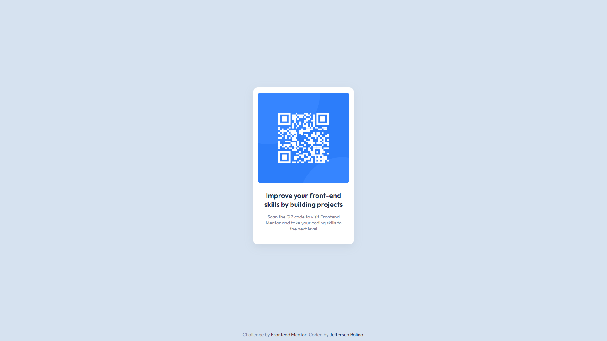

# Frontend Mentor - QR code component solution

This is a solution to the [QR code component challenge on Frontend Mentor](https://www.frontendmentor.io/challenges/qr-code-component-iux_sIO_H). Frontend Mentor challenges help you improve your coding skills by building realistic projects. 

## Table of contents

- [Overview](#overview)
  - [Screenshot](#screenshot)
  - [Links](#links)
- [My process](#my-process)
  - [Built with](#built-with)
  - [What I learned](#what-i-learned)
  - [Continued development](#continued-development)
  - [Useful resources](#useful-resources)
- [Author](#author)
- [Acknowledgments](#acknowledgments)

## Overview

This is the solution for the QR Code Component challenge for Frontend Mentor website.

### Screenshot

### Links

- Repository URL: [Github Repository](https://github.com/JeffersonRolino/frontend-mentor_qr-code-component-solution)
- Live Site URL: [Github Page](https://your-live-site-url.com)

## My process

### Built with

- CSS Variables
- CSS Grid
- CSS Flexbox
- Mobile-first workflow

## Author

- Website - [Jefferson Rolino](https://github.com/JeffersonRolino)
- Frontend Mentor - [@JeffersonRolino](https://www.frontendmentor.io/profile/JeffersonRolino)
- Twitter - [@JRolino](https://twitter.com/JRolino)

